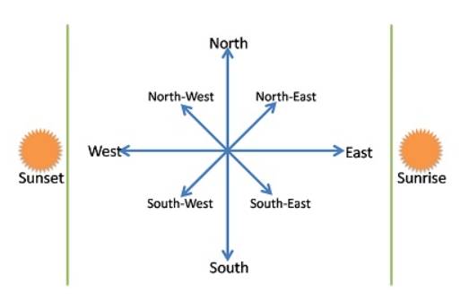
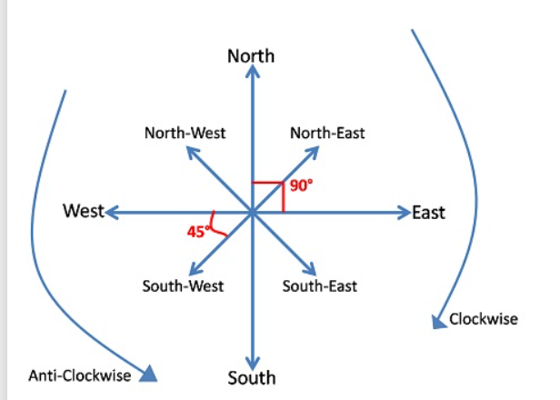
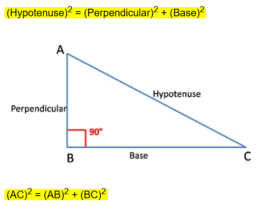

# Direction Sense

## Introduction
Direction Sense questions test one's ability to understand and visualize directions and distances based on given conditions. These questions are common in competitive exams like IBPS PO, IBPS Clerk, CMAT, GMAT, CAT, SSC CGL, and more.

## Basic Concepts

### **Main Directions**
There are four main directions:
- **North (N)**
- **South (S)**
- **East (E)**
- **West (W)**

### **Cardinal Directions**
Between the main directions, four intermediate directions exist:
- **North-East (NE)**
- **North-West (NW)**
- **South-East (SE)**
- **South-West (SW)**

### **Angle Between Directions**
- The angle between two main directions is **90°**.
- The angle between a main direction and its adjacent cardinal direction is **45°**.

### **Right and Left Turns**
- A **right turn** is a **clockwise** movement of **90°**.
- A **left turn** is an **anti-clockwise** movement of **90°**.

**Example:** If a person is facing west and turns **45° clockwise**, they will face **North-West (NW)**.

----

### ***Here's how the right direction works based on the facing direction:***

1. Facing North → Right is East
2. Facing South → Right is West
3. Facing East → Right is South
4. Facing West → Right is North

## **Pythagoras Theorem for Distance Calculation**

In some problems, we use the Pythagoras theorem to find distances:
\[ (Hypotenuse)^2 = (Perpendicular)^2 + (Base)^2 \]

### **Example:**
If a person walks 3 km east and then 4 km north, the shortest distance from the start point is:
\[ \sqrt{(3^2 + 4^2)} = \sqrt{9 + 16} = \sqrt{25} = 5 \] km.

## **Key Points About Shadows**
1. No shadow at **12 Noon**.
2. Before **12 PM**, shadows fall towards the **west**.
3. After **12 PM**, shadows fall towards the **east**.
4. A person facing **north** will have their shadow **left side before 12 PM** and **right side after 12 PM**.
5. A person facing **south** will have their shadow **right side before 12 PM** and **left side after 12 PM**.

## **Question Types**

### **1) Direction-Based Questions**

#### **Example 1:**
**Joe walks 15 miles north, turns left, and walks 10 miles. Then he turns right and walks 10 miles. He turns right again and walks 30 miles. Which direction is he from the starting point?**

**Solution:**
Joe's movement:
- **15 miles north**
- **10 miles west**
- **10 miles north**
- **30 miles east**

Final position is **North-East** of the starting point.
**Answer:** **North-East (b)**

### **2) Distance-Based Questions**

#### **Example 2:**
**Maria walked 30 m north, turned right, walked 40 m, then turned right and walked 45 m. She then turned left and walked 25 m. Finally, she turned left and walked 15 m. How far is she from the starting position?**

**Solution:**
Maria's movements:
- **30 m north**
- **40 m east**
- **45 m south**
- **25 m east**
- **15 m north**

Using the Pythagoras theorem, her distance from the start is **65 m**.
**Answer:** **65 m (b)**

### **3) Direction-Distance-Based Questions**

#### **Example 3:**
**A car travels 25 km south from a garage, then turns left and travels 30 km. Then it turns right and travels 15 km. How far is the car from the garage and in which direction?**

**Solution:**
- Moves **25 km south**
- Moves **30 km east**
- Moves **15 km south**

Using Pythagoras:
\[ \sqrt{(30^2 + 40^2)} = \sqrt{900 + 1600} = \sqrt{2500} = 50 \] km.

Final direction is **South-East**.
**Answer:** **50 km South-East (d)**

## **Exercises**

### **1) Direction Sense**
**A) One morning after sunrise, Joe was standing facing a pole. The shadow of the pole fell exactly to his right. To which direction was he facing?**
- (a) East  
- (b) South  
- (c) West  
- (d) Data is inadequate  

**B) James and Henry were standing facing each other at 8 AM. The shadow of Henry fell exactly to his right. To which direction was James facing?**
- (a) East  
- (b) South  
- (c) North  
- (d) Data is inadequate  

### **2) Distance Calculation**
**C) Ted drives 10 miles north from his office, then turns 270° clockwise and drives 20 miles. Now, he turns 270° anti-clockwise and drives 37 miles. Finally, he reaches his house after driving 20 miles to his right. How far is Ted’s house from his office and in which direction?**
- (a) 40 km South  
- (b) 47 km North  
- (c) 30 km East  
- (d) 37 km West  

### **3) Pythagoras-Based Questions**
**D) John starting from his house, goes 21 miles west, then he turns 90° clockwise and goes 20 miles. What minimum distance should be covered by him to come back to his house?**
- (a) 41  
- (b) 21  
- (c) 29  
- (d) 59  

### **4) Shadow-Based Questions**
**E) Prince was standing facing the Pole at 1:48 PM. The shadow of the Pole fell towards his right. To which direction was Prince facing?**
- (a) West  
- (b) South  
- (c) East  
- (d) North  

### Video link
https://www.youtube.com/watch?v=x0WkptLF6oE&list=PLpyc33gOcbVC2wRtQXK8Gdt1VFjeVY4ea&index=5

### Pratice questions Link
https://www.careerride.com/mcq/direction-sense-test-logical-reasoning-mcq-questions-370.aspx

## **Conclusion**
Practicing direction sense questions enhances logical reasoning and spatial awareness. Using diagrams to visualize movements and applying the Pythagoras theorem where needed will make solving these questions easier.