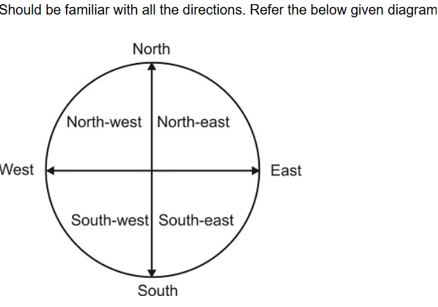

# Seating Arrangement

## Importance of Topic

Questions from this topic are frequently asked in entrance exams such as CAT, CMAT, etc. It helps in arranging objects or people in a predetermined manner after performing necessary analysis over raw data.

## Pre-Requisites

One should be familiar with all the directions. Refer to the diagram below:


**Note:**
- If a person is facing **North**, then "Your left and right" will be the same as the "Person facing North."
- If a person is facing **South**, then it will be a mirror image, i.e., "Person’s Left" will be "Your Right" and vice-versa.
- In **Circular Seating Arrangement**:
  - When all the persons are facing **inwards**, the persons to the **right** are in an **anti-clockwise** direction, and to the **left** are in a **clockwise** direction.
  - When all the persons are facing **outwards**, the persons to the **left** are in an **anti-clockwise** direction, and to the **right** are in a **clockwise** direction.

**Seating Arrangement Cheat Sheet**

### **1. Directions and Left-Right Rules**

#### **Basic Directions:**
- **North (↑)**
- **South (↓)**
- **East (→)**
- **West (←)**

#### **Understanding Left & Right:**
- If a person is **facing North**, their **left is West** and **right is East**.
- If a person is **facing South**, their **left is East** and **right is West**.
- If a person is **facing East**, their **left is North** and **right is South**.
- If a person is **facing West**, their **left is South** and **right is North**.

| Facing Direction | Left | Right |
|-----------------|------|-------|
| North          | West | East  |
| South          | East | West  |
| East           | North | South |
| West           | South | North |

---

### **2. Seating Arrangements**

#### **A. Linear Seating Arrangement (Row/Line)**
- People are seated in a **single row or multiple rows**.
- They may be **facing the same direction** or **opposite directions**.
- Example:
  - A B C D E (all facing North)
  - If A faces South, the left-right changes accordingly.

#### **B. Circular Seating Arrangement**
- People sit around a circular table.
- Two cases:
  - **Facing Center** → **Clockwise (Right) & Anti-clockwise (Left)**.
  - **Facing Outside** → **Clockwise (Left) & Anti-clockwise (Right)**.

| Facing Direction | Clockwise | Anti-clockwise |
|-----------------|-----------|---------------|
| Inside (Facing Center) | Right | Left |
| Outside (Facing Outward) | Left | Right |

#### **C. Rectangular/Square Seating Arrangement**
- People sit at a rectangular or square table.
- Rules are the same as circular seating but adjusted for corners and sides.
- Those sitting at corners have **two adjacent neighbors**.
- Those sitting at sides have **one neighbor on each side**.

---

### **3. Key Tips to Solve Seating Arrangement Questions**
1. **Read the question carefully** and note down key conditions.
2. **Identify fixed positions first** (like "X sits at the extreme left").
3. **Use a diagram** to visualize the arrangement.
4. **Follow direction rules** (left/right changes with facing direction).
5. **Cross-check all conditions** before finalizing.

By following these rules, you can quickly and accurately solve seating arrangement problems!


## Tricks to Solve Questions

1. **Prepare a Seating Frame**
   - Count the total number of people and prepare a "Seating Frame."
   - Example:
     - If there are 7 persons in a single row:
       ```
       A  B  C  D  E  F  G
       ```
     - If there are 4 persons on a circular table:
       ```
       ( A )---( B )
         |       |
       ( D )---( C )
       ```
2. **Solve individual statements and merge small sets into a final complete set.**

---

## Types of Seating Arrangements

1. **Single Row Arrangement**
   - Example: A, B, C, D, E, F, and G are sitting in a single row facing North.
   - Given conditions:
     - D is to the immediate right of C.
     - E and A are neighbors of F.
     - B is to the immediate left of C and on the second place from the leftmost end.
     - A is at the rightmost end.

   **Questions:**
   1. Who is in between C and E? (Answer: None of these)
   2. Who are the neighbors of G? (Answer: Only B)
   3. What is the position of E? (Answer: 5th from left)

2. **Double Row Arrangement**
   - Example:
     - Five boys: Ashwin, Dipesh, Eshan, Chetan, Bipin
     - Five girls: Parul, Komal, Radha, Savita, Vimla
     - Boys and girls sit in two rows facing each other.
     - Given conditions:
       - Eshan is to the immediate right of Bipin and opposite to Parul.
       - Radha is immediate to the right of Komal and opposite to Chetan.
       - Ashwin is opposite to Komal, who is third to the right of Savita.
       - Dipesh and Vimla are not opposite each other.

   **Questions:**
   1. Who is in the middle of the row of boys? (Answer: Bipin)
   2. Who is immediately to the right of Parul? (Answer: Vimla)
   3. Who is opposite to Dipesh? (Answer: Savita)
   4. How many boys are there between Ashwin and Bipin? (Answer: 0)

3. **Circular Table Arrangement**
   - Example: Six friends are sitting in a circle facing **inwards**.
   - Given conditions:
     - Priti and Ashwini are exactly opposite to each other.
     - Sachin is in between Priti and Dipen.
     - Dipen is immediately to the left of Ashwini.
     - Rishi is not exactly opposite to Dipen.

   **Questions:**
   1. Who are the neighbors of Dipen? (Answer: Ashwini and Sachin)
   2. Who is sitting opposite to Dipen? (Answer: Rupesh)
   3. Who is just right of Ashwini? (Answer: Rishi)

4. **Rectangular Seating Arrangement**
   - Example:
     - A, B, C, D, E, and F are sitting around a rectangular table.
     - Given conditions:
       - A is sitting on a side alone.
       - B and C are sitting on the same side.
       - F is facing A.
       - D is the immediate left of F.
       - C is facing D.

   **Questions:**
   1. Who is immediate right of A? (Answer: E)
   2. Who is between B and F? (Answer: C)

### Video Link
https://www.youtube.com/watch?v=GYe98jwCn7g&list=PLpyc33gOcbVC2wRtQXK8Gdt1VFjeVY4ea&index=2

### Pratice questions Link
https://www.careerride.com/mcq/seating-arrangement-logical-reasoning-mcq-questions-372.aspx


## Conclusion

Understanding seating arrangements is crucial for logical reasoning problems in competitive exams. By using systematic approaches such as forming a seating frame, analyzing statements one by one, and merging partial solutions, solving these problems becomes much easier.

